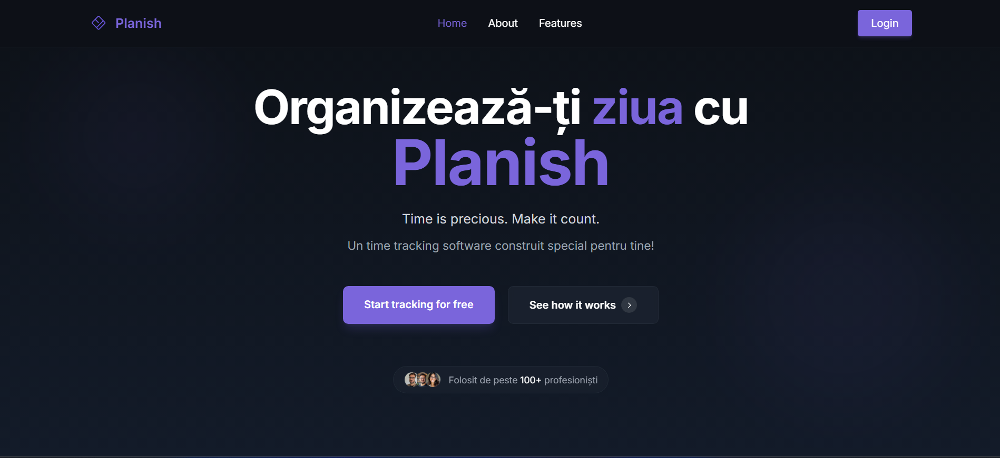
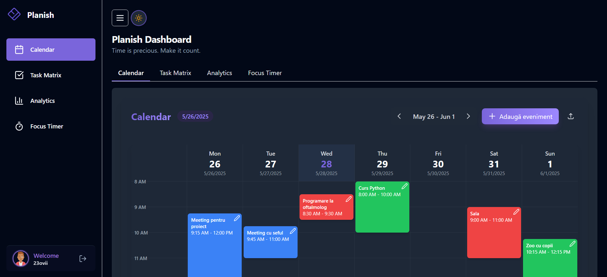
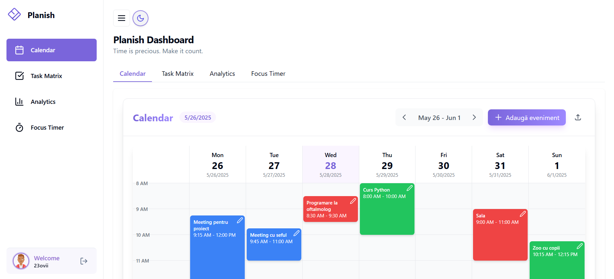

<div align="center">
  
  
  <p align="center">
    <strong>A lightning-fast, minimalistic daily task planner built for pure focus.</strong><br>
    ✨ No logins. No databases. No distractions. Just you and your mission.
  </p>
  
  <p align="center">
    
    
    
    
  </p>

  <p align="center">
    <a href="#-features"></a>
    <a href="#%EF%B8%8F-quick-start"></a>
    <a href="#-live-demo"></a>
    <a href="#-tech-stack"></a>
    <a href="#%EF%B8%8F-roadmap"></a>
    <a href="#-contributing"></a>
  </p>
  
  <br>
  
</div>

---

## 🧩 Features

<table align="center">
<tr>
<td width="50%">

### ⚡ **Lightning Fast**
- Loads in **< 100ms**
- Zero dependencies
- Instant task updates
- No loading screens

### 🎯 **Focus-First Design**
- Distraction-free interface
- Clean, minimal aesthetic
- Dark mode optimized
- Mobile-responsive

</td>
<td width="50%">

### 🔒 **Privacy by Design**
- **100% local storage**
- No data collection
- No tracking scripts
- Works offline

### 🛠️ **Developer Friendly**
- Pure HTML/CSS/JS
- No build process
- Easy to customize
- Open source

</td>
</tr>
</table>

<div align="center">
  
</div>

---

## ⚡️ Quick Start

```bash
# Clone the magic ✨
git clone https://github.com/23ovii/Planish

# Enter the realm 🚪
cd Planish

# Launch your productivity 🚀
open index.html
# or simply double-click index.html
```

> 💡 **That's it!** No npm, no webpack, no complexity. Just pure simplicity.

---

## 🚀 Live Demo

<div align="center">
  <a href="https://23ovii.github.io/Planish/" target="_blank">
    
  </a>
  
  <p><strong>Experience Planish in action!</strong></p>
  <p>👆 Click above to open the live demo in a new tab</p>
</div>

### 📸 Visual Showcase

<details>
<summary><strong>🌙 Dark Mode Experience</strong></summary>
<br>
<p align="center">
  
</p>
</details>

<details>
<summary><strong>☀️ Light Mode Experience</strong></summary>
<br>
<p align="center">
  
</p>
</details>

---

## 🧪 Tech Stack

<div align="center">
  <table>
    <tr>
      <td align="center" width="96">
        
        <br><strong>HTML5</strong>
      </td>
      <td align="center" width="96">
        
        <br><strong>CSS3</strong>
      </td>
      <td align="center" width="96">
        
        <br><strong>Tailwind</strong>
      </td>
      <td align="center" width="96">
        
        <br><strong>Vanilla JS</strong>
      </td>
    </tr>
  </table>
</div>

**Why this stack?**
- 🚀 **Maximum Performance** - No framework overhead
- 🎯 **Zero Dependencies** - Everything you need, nothing you don't
- 📱 **Universal Compatibility** - Runs everywhere HTML works
- 🔧 **Easy Maintenance** - Simple codebase, easy to understand

---

## 🗺️ Roadmap

### 🔥 **Next Up (v2.0)**
- [ ] **⌨️ Keyboard Shortcuts** - `Ctrl+N` for new task, `Enter` to save, `Esc` to cancel

### 🌟 **Power User Features (v3.0)**
- [ ] **📊 Productivity Analytics** - Track completion rates and productivity patterns
- [ ] **🎨 Custom Themes** - Multiple color schemes and personalization options
- [ ] **📱 PWA Support** - Install as native app on mobile/desktop
- [ ] **🔄 Task Templates** - Save and reuse common task patterns
- [ ] **📅 Calendar Integration** - Sync with Google Calendar, Outlook

### 🚀 **Advanced Features (v4.0)**
- [ ] **🤖 Smart Suggestions** - AI-powered task recommendations
- [ ] **📈 Habit Tracking** - Build and maintain daily habits
- [ ] **👥 Team Collaboration** - Share task lists with colleagues/family
- [ ] **🔗 API Integration** - Connect with Todoist, Notion, Trello
- [x] **📊 Export/Import** - JSON, CSV export for data portability
- [ ] **🌍 Multi-language Support** - Internationalization for global users

### 💡 **Community Ideas**
- [ ] **🎵 Focus Sounds** - Built-in ambient sounds for productivity
- [ ] **🏆 Gamification** - Points, streaks, and achievements
- [x] **📝 Task Notes** - Add detailed descriptions to tasks
- [ ] **🔍 Search & Filter** - Find tasks quickly in large lists
- [ ] **⏱️ Time Tracking** - Track time spent on each task

---

## 🤝 Contributing

We'd love your help making Planish even better! Here's how to contribute:

### 🚀 **Quick Contribution**
```bash
# 1. Fork this repo
# 2. Clone your fork
git clone https://github.com/YOUR_USERNAME/Planish

# 3. Create a feature branch
git checkout -b feature/amazing-feature

# 4. Make your magic happen ✨
# Edit the code, add features, fix bugs

# 5. Commit your changes
git commit -m "feat: add amazing feature"

# 6. Push and create PR
git push origin feature/amazing-feature
```

### 💡 **Ways to Contribute**
- 🐛 **Report Bugs** - Found an issue? Let us know!
- ✨ **Suggest Features** - Have a cool idea? Share it!
- 📖 **Improve Docs** - Help make our documentation better
- 🎨 **Design** - Contribute themes, icons, or UI improvements
- 🧪 **Testing** - Help test new features across different devices

### 🏆 **Hall of Fame**
Special thanks to all contributors who help make Planish better!

<a href="https://github.com/23ovii/Planish/graphs/contributors">
  
</a>

---

## 📄 License

This project is licensed under the **MIT License** - see the [LICENSE](LICENSE) file for details.

```
MIT License - Feel free to use, modify, and distribute! 🎉
```

---

<div align="center">
  
  
  <h2>🧠 Transform Your Productivity with Planish</h2>
  <p><strong>Simple. Fast. Focused.</strong></p>
  
  <p>
    Built with ❤️ by <a href="https://github.com/23ovii"><strong>23ovii</strong></a><br>
    <em>Making productivity simple, one task at a time.</em>
  </p>
  
  <p>
    <a href="https://github.com/23ovii/Planish/stargazers">⭐ Star this repo</a> •
    <a href="https://github.com/23ovii/Planish/issues">🐛 Report bugs</a> •
    <a href="https://github.com/23ovii/Planish/discussions">💬 Discussions</a>
  </p>
  
  <br>
  
  **If Planish helps you stay organized, consider giving it a ⭐!**
</div>
